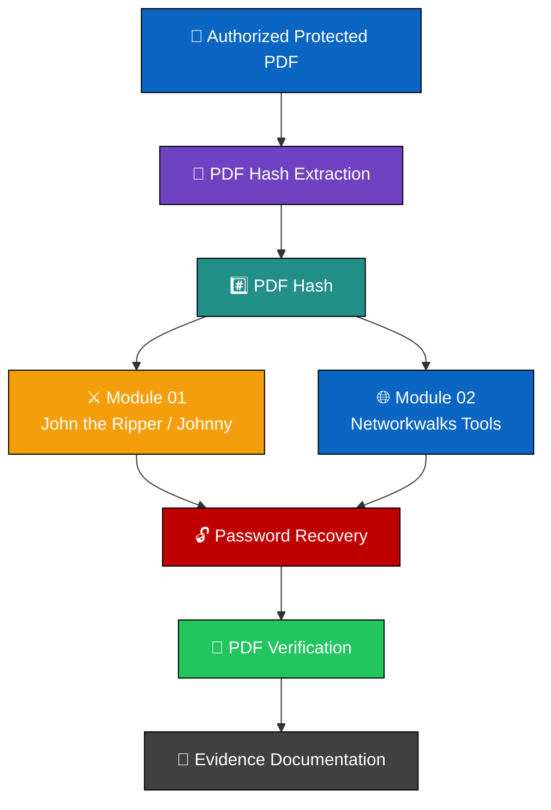
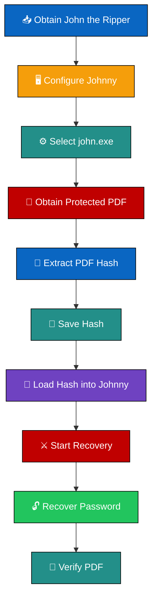

<div align="center">

# 🛡️ PASSWORD SECURITY & CRACKING LABS

### 🔐 PASSWORD SECURITY • HASH ANALYSIS • PASSWORD RECOVERY


<br>

**W3-PS-FINAL | CYBERSECURITY | NETWORKWALKS**

### 👤 Alebiosu Oluwadamilare Samuel
**Cybersecurity Professional | Networkwalks Intern | Batch B082**

**Assessment Submitted: 25 August 2026**

---

</div>

## 🛡️ Engagement Overview

| **Category** | **Details** |
|---|---|
| 👤 **Student / Analyst** | Alebiosu Oluwadamilare Samuel |
| 🎓 **Program / Batch** | B082 Networkwalks |
| 📅 **Assessment Submitted** | 25 August 2026 |
| 🧪 **Week** | Week 03 |
| 🔐 **Primary Focus** | Password Security & Cracking |
| ⚔️ **Module 01** | Password Cracking with John the Ripper & Johnny |
| 🌐 **Module 02** | Password Cracking with Networkwalks Tools |
| 📄 **Assessment Target** | Authorized Protected PDF Laboratory Target |
| 🖥️ **Primary Platform** | Windows |
| 🔎 **Hash Format** | PDF Hash / `$pdf$...` |
| 📸 **Evidence** | Screenshots, lab notes, and verification evidence |
| 🔐 **Authorization** | Controlled Educational Laboratory Environment |
| 📊 **Assessment Status** | Completed |

---

# 🛡️ 1. Liability & Authorization Disclaimer

> **AUTHORIZED SECURITY TESTING ONLY**

All activities documented in this project were performed within an **authorized cybersecurity training and laboratory environment** using the protected PDF supplied for the practical exercise.

The techniques demonstrated in this repository are intended strictly for:

- Cybersecurity education
- Ethical hacking training
- Password-security research
- Authorized laboratory testing
- Professional skill development

Password-recovery and security-testing techniques must only be used against files, systems, or environments for which appropriate authorization has been obtained.

Unauthorized password cracking, credential recovery, access attempts, or interference with computer systems may violate applicable laws and regulations.

**Do not use the techniques, commands, or tools documented in this repository against systems or files without explicit authorization.**

> 🛡️ **Security principle:** Always define and respect the authorized scope before performing security testing.

---

# 🛡️ 2. Introduction

This cybersecurity project documents the practical activities completed during **Week 3 of my Cybersecurity & Ethical Hacking internship with Networkwalks Academy**.

The week's practical work focused on **password security, password hashes, protected files, password recovery, security tooling, and professional evidence documentation**.

The practical was divided into two related modules:

```text
MODULE 01
John the Ripper + Johnny
        ↓
PDF Hash Extraction
        ↓
Password Recovery
        ↓
PDF Verification

MODULE 02
Networkwalks Hash Calculator
        ↓
PDF Hash Extraction
        ↓
Networkwalks Password Cracker
        ↓
Password Recovery
        ↓
PDF Verification
```

The exercises demonstrated how password-security testing can be performed using both a **locally installed password-security tool** and a **browser-based training tool**.

A major component of the practical was also the collection and organization of **technical evidence** to demonstrate each stage of the workflow.

---

# 🛡️ 3. Objectives

The primary objectives of the Week 3 practical were to:

-  Understand password-security fundamentals
-  Understand password hashes and protected-file hashes
-  Work with **John the Ripper (JTR)**
-  Configure and use **Johnny GUI**
-  Extract a PDF password hash
-  Save and handle a hash file correctly
-  Perform password recovery within an authorized lab
-  Use the Networkwalks Hash Calculator
-  Use the Networkwalks Password Cracker
-  Verify recovered credentials against the supplied PDF
-  Capture practical evidence
-  Produce professional cybersecurity documentation
-  Understand the importance of strong passwords

---

# 🛡️ 4. Tools & Technologies

| **Tool / Technology** | **Purpose** |
|---|---|
|  **Windows** | Primary practical environment |
|  **John the Ripper** | Password-security testing and password recovery |
|  **Johnny GUI** | Graphical interface for John the Ripper |
|  **Web Browser** | Accessing Networkwalks security tools |
|  **Networkwalks Hash Calculator** | Extracting the PDF hash |
|  **Networkwalks Password Cracker** | Password-recovery exercise |
|  **Protected PDF** | Authorized laboratory target |
|  **PDF Hash** | Input for password-recovery workflows |
|  **hash1.txt** | Stored PDF hash for the JTR workflow |
|  **hash2.txt** | Stored PDF hash for the JTR workflow |
|  **hash3.txt** | Stored PDF hash for the JTR workflow |
|  **Screenshots** | Practical evidence and documentation |

---

# 🛡️ 5. Lab Architecture

The Week 3 exercises followed two password-recovery workflows using the same authorized laboratory target.



---

# 🛡️ 6. Module 01 Password Cracking with John the Ripper

## 6.1 🔎 Module Overview

The first practical focused on **John the Ripper (JTR)** and its graphical interface, **Johnny**.

The exercise involved working with an authorized protected PDF, extracting the corresponding PDF hash, loading the hash into Johnny, initiating password recovery, and verifying the recovered password against the protected PDF.

The workflow demonstrated the relationship between:

```text
Protected PDF
      ↓
PDF Hash
      ↓
Hash File
      ↓
John the Ripper / Johnny
      ↓
Password Recovery
      ↓
PDF Verification
```

---

## 6.2 🛠️ Module Environment

| **Component** | **Details** |
|---|---|
|  **Platform** | Windows PC |
|  **Password Tool** | John the Ripper |
|  **GUI** | Johnny |
|  **Target** | Authorized Protected PDF |
|  **Input** | PDF Hash |
|  **Hash File** | `hash1.txt` |
|  **Hash File** | `hash2.txt` |
|  **Hash File** | `hash3.txt` |
|  **Verification** | Protected PDF |

---

## 6.3 🔄 Module 01 Workflow



---

## 6.4 🧪 Practical Procedure

### 🔹 6.4.1 Obtain John the Ripper

John the Ripper was obtained for the Windows environment as required for the laboratory exercise.

---

### 🔹 6.4.2 Configure Johnny

Johnny GUI was configured to work with the John the Ripper installation.

The `john.exe` executable was selected from the appropriate JTR `run` directory.

---

### 🔹 6.4.3 Obtain the Protected PDF

The protected PDF supplied for the cybersecurity practical was used as the authorized laboratory target.

---

### 🔹 6.4.4 Extract the PDF Hash

The protected PDF was processed to obtain its corresponding password hash.

The resulting hash followed the expected PDF hash format beginning with:

```text
$pdf$
```

---

### 🔹 6.4.5 Create the Hash File

The extracted hash was saved into a text file:

```text
hash1.txt
```

The hash was preserved as required so that it could be loaded into Johnny.

---

### 🔹 6.4.6 Load the Hash into Johnny

The saved hash file was loaded through Johnny using the password-file workflow.

This provided JTR with the required hash input for the laboratory exercise.

---

### 🔹 6.4.7 Start Password Recovery

A password-recovery process was initiated through Johnny.

The recovery process demonstrated how password-security tools can test candidate passwords against a supplied password hash.

Recovery time can vary depending on factors such as:

- Password complexity
- Candidate search space
- System performance
- Available processing resources
- Attack configuration

---

### 🔹 6.4.8 Verify the Recovered Password

The recovered password was used to open the protected PDF.

Successful opening of the PDF provided verification that the password-recovery process had produced the expected result.

---

# 🛡️ 7. Module 01 Evidence

> Evidence screenshots are organized under:
>
> `module-1-jtr/evidence/`

### 🖥️ JTR / Johnny Setup


---

### 🔎 PDF Hash Extraction


---

### 📝 Hash File


---

### ⚔️ Password Recovery


---

### 🔓 Verification


---

# 🛡️ 8. Module 02 — Password Cracking with Networkwalks Tools

## 8.1 🌐 Module Overview

The second practical focused on browser-based password-security tools provided as part of the Networkwalks training exercise.

The module used:

- **Networkwalks Hash Calculator**
- **Networkwalks Password Cracker**

The workflow involved extracting the PDF hash, copying the complete hash value, submitting it to the password-recovery tool, and verifying the resulting password against the protected PDF.

---

## 8.2 🛠️ Module Environment

| **Component** | **Details** |
|---|---|
| 💻 **Platform** | Windows Laptop |
| 🌐 **Interface** | Web Browser |
| 🔎 **Hash Tool** | Networkwalks Hash Calculator |
| ⚔️ **Recovery Tool** | Networkwalks Password Cracker |
| 📄 **Target** | Authorized Protected PDF |
| #️⃣ **Input** | PDF Hash |

---

## 8.3 🔄 Module 02 Workflow


---

## 8.4 🧪 Practical Procedure

### 🔹 8.4.1 Obtain the Encrypted PDF

The protected PDF supplied for the laboratory exercise was obtained and used as the authorized target.

---

### 🔹 8.4.2 Open the Hash Calculator

The Networkwalks Hash Calculator was opened through a web browser.

---

### 🔹 8.4.3 Upload the PDF

The protected PDF was uploaded to the Hash Calculator.

The tool generated the corresponding PDF hash.

The generated value followed the expected:

```text
$pdf$
```

format.

---

### 🔹 8.4.4 Copy the Complete Hash

The complete hash value was copied for use during the next stage.

Preserving the complete hash was important because the entire value represents the required input for the password-recovery workflow.

---

### 🔹 8.4.5 Open the Password Cracker

The Networkwalks Password Cracker was opened in the browser.

---

### 🔹 8.4.6 Submit the Hash

The extracted PDF hash was submitted to the Password Cracker and the recovery process was initiated.

---

### 🔹 8.4.7 Verify the Result

After the password-recovery process completed, the recovered password was used to open the protected PDF.

Successful access to the document provided verification of the recovery result.

---

# 🛡️ 9. Module 02 — Evidence

> Evidence screenshots are organized under:
>
> `module-2-networkwalks-tools/evidence/`

### 🌐 Networkwalks Hash Calculator


---

### #️⃣ Extracted PDF Hash


---

### ⚔️ Password Cracker


---

### ✅ Recovery Result


---

### 🔓 PDF Verification


---

# 🛡️ 10. Module Comparison

| **Category** | ⚔️ **Module 01 — JTR** | 🌐 **Module 02 — Networkwalks Tools** |
|---|---|---|
| **Primary Tool** | John the Ripper | Networkwalks Password Cracker |
| **Interface** | Johnny GUI | Web Browser |
| **Hash Extraction** | PDF hash extraction workflow | Networkwalks Hash Calculator |
| **Target** | Protected PDF | Protected PDF |
| **Hash Format** | `$pdf$...` | `$pdf$...` |
| **Environment** | Windows | Web Browser |
| **Recovery Process** | JTR-based | Networkwalks tool |
| **Verification** | Open protected PDF | Open protected PDF |
| **Evidence** | Screenshots | Screenshots |

---

# 🛡️ 11. Password Security Concepts

## 🔐 11.1 Password Cracking

Password cracking refers to the process of recovering a password from a password-related representation such as a hash or protected-file credential mechanism.

In a legitimate cybersecurity context, password-recovery techniques can be used to evaluate password strength and demonstrate the risks associated with weak credentials.

---

## #️⃣ 11.2 Hashing

Hashing transforms data into a derived representation known as a hash or message digest.

In this practical, the PDF hash served as an input to the password-recovery workflows.

The important concept demonstrated was that security tools can operate against password-related representations rather than directly modifying the protected file.

---

## 🔄 11.3 Encryption vs Hashing

Encryption and hashing serve different security purposes.

```text
ENCRYPTION
Plaintext
   ↓
Encryption
   ↓
Ciphertext
   ↓
Decryption with appropriate key
   ↓
Plaintext


HASHING
Input
   ↓
Hash Function
   ↓
Hash / Digest
```

Encryption is designed to be reversible when the appropriate key is available, while cryptographic hashing is generally designed as a one-way transformation.

The protected PDF exercise provided a practical demonstration of how password protection and password-recovery workflows can be analyzed during authorized security testing.

---

# 🛡️ 12. Skills Demonstrated

<p align="center">


</p>

### Technical Skills

- 🔐 Password-security testing
- #️⃣ Hash extraction and handling
- ⚔️ John the Ripper
- 🖥️ Johnny GUI
- 🌐 Networkwalks security tools
- 📄 Protected-file analysis
- 🧪 Controlled security testing
- 📸 Evidence collection
- 📝 Technical documentation
- 🔎 Security workflow analysis

---

# 🛡️ 13. Observations & Technical Considerations

## 🔎 Observation 01 — Hash Format

The PDF hash must be preserved correctly before being supplied to the password-recovery tool.

The `$pdf$` prefix is an important indicator of the PDF hash format used during the practical.

---

## ⏱️ Observation 02 — Recovery Time

Password-recovery duration can vary depending on:

- Password complexity
- Search space
- Attack configuration
- Hardware capabilities
- Processing performance

A simple password may be recovered significantly faster than a complex password with a large candidate space.

---

## 📝 Observation 03 — Evidence Matters

The practical demonstrated that cybersecurity work is not limited to running tools.

A professional assessment should also demonstrate:

```text
What was performed
        ↓
How it was performed
        ↓
What was observed
        ↓
What evidence supports the observation
        ↓
What the observation means
```

This makes the work reproducible, reviewable, and professionally documented.

---

## 🔐 Observation 04 — Password Strength

The practical reinforces the importance of strong passwords.

Weak or predictable passwords may be significantly easier to recover during password-security testing.

Organizations and users should therefore use strong, unique credentials and appropriate authentication controls.

---

# 🛡️ 14. Risk Analysis & Impact

| **#** | 🔎 **Observation** | 📊 **Security Relevance** | ⚠️ **Potential Impact** | **Risk** |
|---:|---|---|---|---|
| 1 | Weak password discovered during authorized recovery exercise | Demonstrates password predictability | Unauthorized access may become easier if similar credentials are used in real systems | 🟠 **Medium** |
| 2 | Password hash available for testing | Hashes can become targets for offline password analysis | Weak passwords may be recovered from compromised hashes | 🟠 **Medium** |
| 3 | Protected file relies on password-based protection | Security depends partly on password strength | Weak credentials may reduce protection effectiveness | 🟠 **Medium** |
| 4 | Password-recovery tools can automate candidate testing | Demonstrates the importance of password resilience | Weak credentials may be recovered more efficiently | 🟠 **Medium** |
| 5 | Hash handling requires accuracy | Incorrect or incomplete hashes may cause recovery workflows to fail | Operational errors during security testing | 🟢 **Low** |

> **Important Assessment Note:**
>
> These observations are based on an **authorized educational laboratory exercise**. They should not be interpreted as vulnerabilities in unrelated production systems.

---

# 🛡️ 15. Recommendations

### 1️⃣ Use Strong Passwords

Passwords should be long, unique, and difficult to predict.

### 2️⃣ Avoid Password Reuse

Users should avoid reusing the same password across multiple systems or services.

### 3️⃣ Use Password Managers

Password managers can assist users in generating and securely storing unique credentials.

### 4️⃣ Implement Multi-Factor Authentication

Where supported, MFA should be enabled to provide an additional authentication layer beyond passwords.

### 5️⃣ Protect Password Hashes

Organizations should securely store password-related data and prevent unauthorized access to credential databases.

### 6️⃣ Use Modern Password-Storage Mechanisms

Production systems should use appropriate password hashing and key-stretching mechanisms rather than storing passwords directly.

### 7️⃣ Perform Authorized Password Audits

Organizations should periodically evaluate password security through authorized security assessments.

### 8️⃣ Monitor Credential Exposure

Organizations should monitor for exposed credentials and take appropriate action when compromise is suspected.

### 9️⃣ Document Security Testing

Security assessments should maintain clear evidence of scope, procedures, observations, and results.

### 🔟 Maintain Authorization

Password-security testing must always be conducted within a clearly defined and authorized scope.

---

# 🛡️ 16. Security Assessment Summary

| **Assessment Area** | **Status** |
|---|---|
| 🔐 Password Security Fundamentals | ✅ Completed |
| #️⃣ PDF Hash Extraction | ✅ Completed |
| ⚔️ John the Ripper Exercise | ✅ Completed |
| 🖥️ Johnny Configuration | ✅ Completed |
| 🌐 Networkwalks Hash Calculator | ✅ Completed |
| ⚔️ Networkwalks Password Cracker | ✅ Completed |
| 🔓 Password Verification | ✅ Completed |
| 📸 Evidence Collection | ✅ Completed |
| 📝 Technical Documentation | ✅ Completed |
| 🧪 Authorized Laboratory Testing | ✅ Completed |

### Overall Practical Progress

```text
PASSWORD SECURITY       ████████████████████ 100%  COMPLETED ✅
HASH EXTRACTION         ████████████████████ 100%  COMPLETED ✅
JTR / JOHNNY             ████████████████████ 100%  COMPLETED ✅
NETWORKWALKS TOOLS       ████████████████████ 100%  COMPLETED ✅
PASSWORD VERIFICATION    ████████████████████ 100%  COMPLETED ✅
DOCUMENTATION            ████████████████████ 100%  COMPLETED ✅
```

---

# 🛡️ 17. Key Learning Outcomes

Through the Week 3 practical exercises, I developed hands-on experience with:

- 🔐 Password-security concepts
- #️⃣ Hash analysis
- 📄 Protected-file analysis
- ⚔️ John the Ripper
- 🖥️ Johnny GUI
- 🌐 Networkwalks security tools
- 🔎 PDF hash extraction
- 🔓 Password recovery workflows
- 📸 Evidence collection
- 📝 Professional technical documentation
- ⚖️ Authorized security-testing principles

The exercises demonstrated how password-security testing can be approached through different tools while following a consistent security-testing methodology.

The practical also reinforced that **technical execution and professional documentation are equally important** in cybersecurity.

---

# 🛡️ 18. Personal Lab Notes & Evidence

The handwritten notes produced during the practical are preserved as additional supporting documentation.

### 📝 Week 3 Lab Notes — JTR / Networkwalks Tools


### 📝 Additional Week 3 Notes


> These notes provide additional evidence of the practical workflow, setup activities, and learning process documented during the internship.

---

# 🛡️ 19. Networkwalks Academy Quiz Assessment

As part of the Networkwalks Academy cybersecurity training program, the knowledge assessment associated with the training was completed as part of the overall learning process.

### 🏆 Quiz Performance

| **Assessment** | **Details** |
|---|---|
| 🎓 **Academy** | Networkwalks Academy |
| 📚 **Program** | Cybersecurity |
| 📅 **Assessment Period** | August 2026 |
| 🧪 **Assessment Type** | Knowledge Assessment |
| 📊 **Score** | **10/10** |
| ✅ **Result** | **Completed** |

### 📸 Score Evidence

_Add the relevant quiz screenshots here if they belong to the Week 3 repository._

---

### 🛡️ Learning Validation

The assessment provided an opportunity to validate theoretical understanding alongside the practical laboratory exercises.

```text
KNOWLEDGE
    ↓
PRACTICAL LAB
    ↓
EVIDENCE
    ↓
DOCUMENTATION
    ↓
SECURITY UNDERSTANDING
```

---

# 🛡️ 20. Conclusion

During **Week 3 of my Cybersecurity & Ethical Hacking internship at Networkwalks Academy**, I completed practical exercises focused on **password security, hash analysis, password recovery, and protected-file security testing**.

The first module provided hands-on experience with **John the Ripper and Johnny**, including PDF hash extraction, hash-file preparation, password recovery, and verification.

The second module provided practical experience with the **Networkwalks Hash Calculator and Password Cracker**, demonstrating a browser-based approach to the same general password-security workflow.

The practical reinforced several important cybersecurity principles:

```text
PASSWORD SECURITY
        ↓
HASH ANALYSIS
        ↓
AUTHORIZED TESTING
        ↓
PASSWORD RECOVERY
        ↓
VERIFICATION
        ↓
EVIDENCE
        ↓
PROFESSIONAL DOCUMENTATION
```

I also learned that effective cybersecurity work involves more than simply operating security tools.

A professional security practitioner must understand:

```text
What was performed
        ↓
Why it was performed
        ↓
What was discovered
        ↓
What the evidence demonstrates
        ↓
What security lesson can be learned
        ↓
How the risk can be reduced
```

Most importantly, the practical reinforced the requirement that password-recovery and security-testing techniques must only be used within an **authorized scope**.

This project represents another step in my development as a cybersecurity professional and contributes to my practical experience in **ethical hacking, password security, security tooling, evidence collection, and technical documentation**.

---

# 🛡️ 21. Evidence Collected

Evidence from the Week 3 practical activities is organized according to the individual modules.

## ⚔️ Module 01 — JTR / Johnny Evidence

<details>
<summary><b>JTR Download / Setup</b></summary>


</details>

<details>
<summary><b>Johnny Configuration</b></summary>


</details>

<details>
<summary><b>John.exe Selection</b></summary>


</details>

<details>
<summary><b>PDF Hash Extraction</b></summary>


</details>

<details>
<summary><b>Hash File</b></summary>


</details>

<details>
<summary><b>Johnny Password File</b></summary>


</details>

<details>
<summary><b>JTR Password Recovery</b></summary>


</details>

<details>
<summary><b>Password Verification</b></summary>


</details>

---

## 🌐 Module 02 — Networkwalks Tools Evidence

<details>
<summary><b>Hash Calculator</b></summary>


</details>

<details>
<summary><b>Extracted PDF Hash</b></summary>


</details>

<details>
<summary><b>Password Cracker</b></summary>


</details>

<details>
<summary><b>Recovery Result</b></summary>


</details>

<details>
<summary><b>PDF Verification</b></summary>


</details>

---

## 📝 Additional Laboratory Evidence

<details>
<summary><b>Week 3 Lab Notes</b></summary>


</details>

<details>
<summary><b>Additional Week 3 Notes</b></summary>


</details>

---

# 🛡️ 22. Project Information

| **Project Detail** | **Information** |
|---|---|
| 👤 **Author** | **Alebiosu Oluwadamilare Samuel** |
| 🏢 **Program** | Cybersecurity Program — Networkwalks |
| 📅 **Week** | **Week 03** |
| 🎓 **Batch** | **B082** |
| 📆 **Assessment Date** | **25 August 2026** |
| 🔐 **Project Type** | Authorized Cybersecurity Laboratory |
| 🛡️ **Primary Focus** | Password Security & Cracking |
| ⚔️ **Module 01** | John the Ripper & Johnny |
| 🌐 **Module 02** | Networkwalks Hash Calculator & Password Cracker |
| 💻 **Primary Platform** | Windows |
| 📄 **Target** | Authorized Protected PDF |
| #️⃣ **Hash Type** | PDF Hash |
| 📸 **Evidence** | Screenshots & Laboratory Notes |
| 📊 **Assessment Status** | Completed |
| 📁 **Repository** | GitHub |

---

# 👤 23. Author

<div align="center">

### **Alebiosu Oluwadamilare Samuel**

**Cybersecurity Professional | Networkwalks Intern | Batch B082**

<br>

🛡️ **Cybersecurity & Ethical Hacking**

<br>

**Week 03 — Password Security & Cracking Labs**

<br>

**Assessment Date — 25 August 2026**

</div>

---

# 🛡️ 24. Assessment Progress

```text
PHASE 1
Password Security Fundamentals
████████████████████████████████  COMPLETED ✅

PHASE 2
PDF Hash Extraction
████████████████████████████████  COMPLETED ✅

PHASE 3
John the Ripper / Johnny
████████████████████████████████  COMPLETED ✅

PHASE 4
Networkwalks Password-Recovery Tools
████████████████████████████████  COMPLETED ✅

PHASE 5
Password Verification & Evidence
████████████████████████████████  COMPLETED ✅

PHASE 6
Professional Documentation
████████████████████████████████  COMPLETED ✅
```

---

<div align="center">

### 🛡️ CYBERSECURITY • ETHICAL HACKING • PASSWORD SECURITY

**Learn → Practice → Analyze → Document → Secure**

<br>

*W3-PS-FINAL | Networkwalks | B082 | 25 August 2026*

<br>

**Alebiosu Oluwadamilare Samuel**

</div>

---
